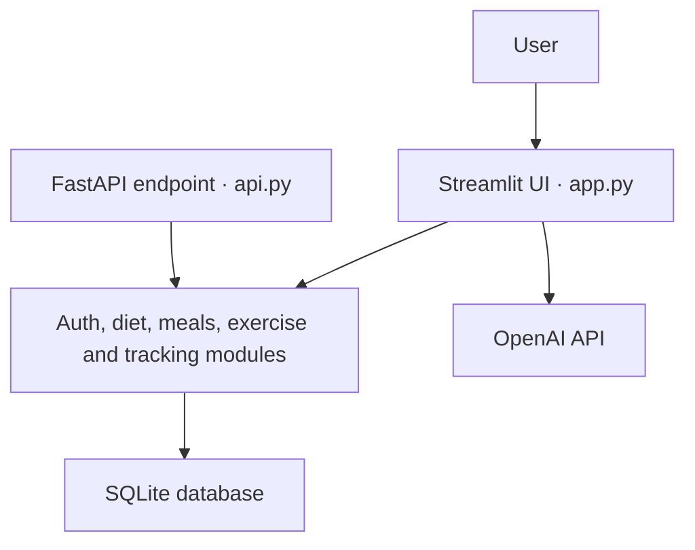

# AI Diet & Lifestyle Assistant

A personalized nutrition and lifestyle tracking web application built with Python and Streamlit. The project combines rule-based calculations, SQLite-backed user tracking, and an OpenAI-powered conversational assistant in a single interface.

[](https://diyet-asistani-ai.streamlit.app/)
[](https://github.com/dilarayesilcayy/diyet-asistani-ai/actions/workflows/python-checks.yml)

## Live Demo

Try the application at **[diyet-asistani-ai.streamlit.app](https://diyet-asistani-ai.streamlit.app/)**.

> **Portfolio project:** This application was developed as a Management Information Systems graduation project. It is intended for educational and demonstration purposes, not as a substitute for professional medical or nutritional advice.

## Problem

Generic diet plans often ignore differences in body measurements, activity level, dietary preferences, budget, allergies, exercise experience, and daily habits. This project explores how those inputs can be organized into a more personalized and accessible decision-support experience.

## Key Features

- User registration and login
- Personal profile management
- BMI and estimated daily calorie calculations
- Goal-based macronutrient strategy
- Weekly meal-plan generation
- Filtering by diet type, allergies, disliked foods, and budget
- Exercise suggestions based on preferences and experience
- Daily tracking for meals, water, sleep, steps, and weight
- Weight-history visualization
- Daily progress scoring and feedback
- Context-aware AI chat powered by the OpenAI API
- A small FastAPI endpoint for profile calculations

## Tech Stack

| Area | Technology |
| --- | --- |
| Interface | Streamlit |
| Language | Python |
| Database | SQLite |
| AI integration | OpenAI API |
| Data handling and charts | pandas, Streamlit charts |
| Optional API | FastAPI, Pydantic, Uvicorn |

## Architecture



The Streamlit interface coordinates the user journey and delegates calculations, recommendations, authentication, and tracking to focused Python modules. Persistent prototype data is handled through SQLite, while the conversational assistant calls the OpenAI API using a secret stored outside the repository.

## Project Structure

```text
.
├── app.py          # Main Streamlit application
├── api.py          # FastAPI calculation endpoint
├── auth.py         # Registration and login logic
├── database.py     # SQLite schema and data-access functions
├── diet.py         # BMI, calorie, macro, filtering, and plan logic
├── meals.py        # Meal data and recommendation functions
├── exercise.py     # Exercise suggestions and step calculations
├── tracking.py     # Daily scoring and feedback
├── ui.py           # Streamlit styling
└── requirements.txt
```

## How It Works

1. A user creates an account and completes a lifestyle profile.
2. The application estimates BMI and daily calorie needs.
3. Meal options are filtered using dietary preferences, allergies, disliked foods, and budget.
4. The system builds a weekly plan and suggests suitable exercise options.
5. Daily meals, water, sleep, steps, and weight are stored in SQLite.
6. The dashboard summarizes progress and provides an AI-assisted conversational experience.

## Local Setup

### Prerequisites

- Python 3.10 or newer
- An OpenAI API key for the chatbot feature

### Installation

```bash
git clone https://github.com/dilarayesilcayy/diyet-asistani-ai.git
cd diyet-asistani-ai
python -m venv .venv
```

Activate the environment:

```bash
# macOS / Linux
source .venv/bin/activate

# Windows PowerShell
.venv\Scripts\Activate.ps1
```

Install the dependencies:

```bash
pip install -r requirements.txt
```

Create `.streamlit/secrets.toml`:

```toml
OPENAI_API_KEY = "your-api-key"
```

Run the Streamlit application:

```bash
streamlit run app.py
```

The local database is created automatically when the application starts.

### Optional FastAPI Endpoint

```bash
uvicorn api:app --reload
```

Then open `http://127.0.0.1:8000/docs` to test the calculation endpoint.

## Current Limitations

- Authentication uses salted PBKDF2 password hashes, but the application remains an educational prototype rather than a production identity system.
- SQLite is used as a local project database and is not designed here for multi-instance production deployment.
- Data stored on Streamlit Community Cloud may reset when the application restarts.
- Meal recommendations are based on a predefined dataset and rule-based filtering.
- Calorie and exercise calculations are estimates.
- Automated tests currently cover core authentication and weekly-plan behavior, not the complete interface.

## Roadmap

- [x] Hash passwords and improve authentication validation
- [x] Remove tracked database files and initialize clean local storage
- [x] Add initial automated tests and continuous integration
- [x] Improve weekly-plan variety and date-aware daily selection
- [ ] Add SQL-based usage analytics to the dashboard
- [ ] Expand input validation and safer error handling
- [x] Publish a Streamlit demo
- [ ] Add screenshots and an architecture diagram

## What I Learned

This project gave me hands-on experience in translating user requirements into a working information system, separating application logic into modules, designing a relational data model, integrating an external AI API, and presenting user data through an interactive dashboard.

## Author

**Dilara Yeşilçay**  
Management Information Systems student  
[LinkedIn](https://www.linkedin.com/in/dilarayesilcay/) · [GitHub](https://github.com/dilarayesilcayy)

## Disclaimer

This software provides general educational information and estimated lifestyle suggestions. It does not diagnose, treat, or prevent any medical condition. Users should consult qualified healthcare professionals for individual medical or nutrition decisions.
